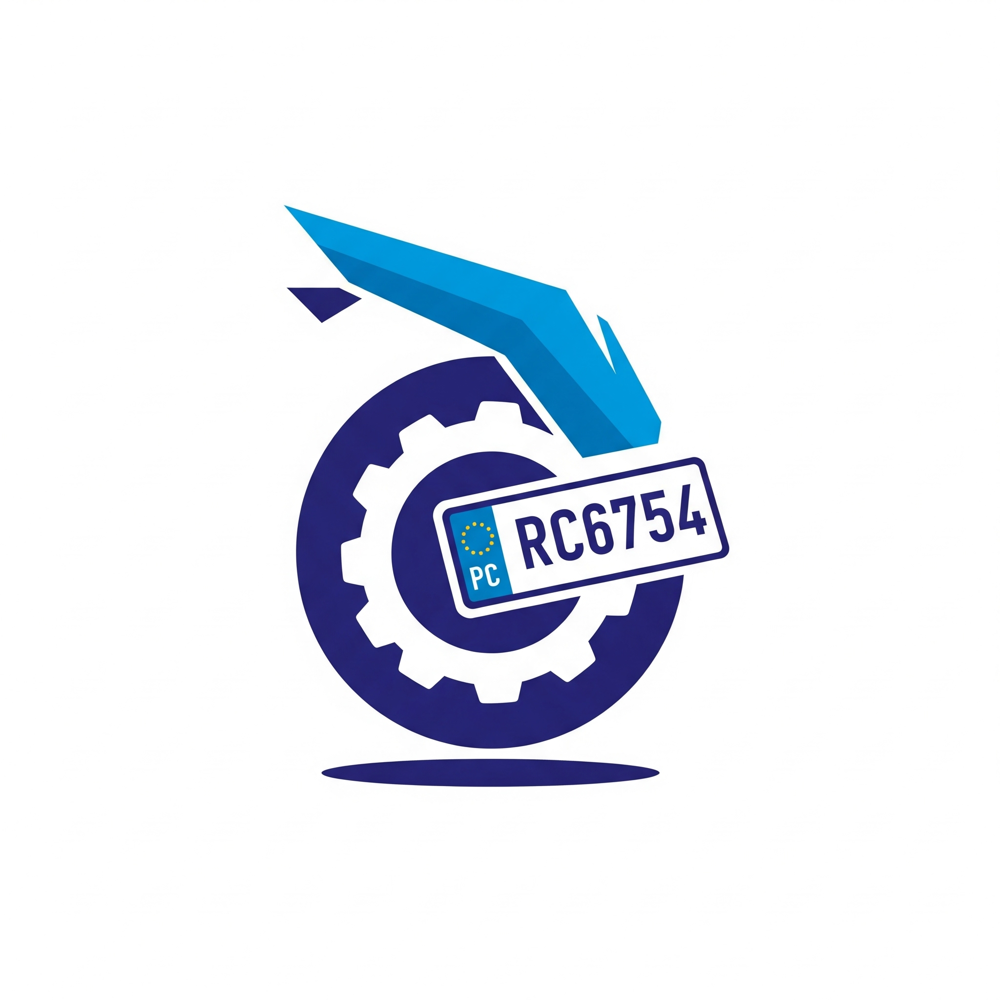

# SmartParker_IOT
Automação de pátios de motos com Visão Computacional: SmartParker detecta, lê e registra placas de veículos, otimizando o controle de frotas e a segurança.


# SmartParker: Sistema Inteligente de Gestão de Estacionamento para Frotas de Motos

<p align="center">
  
</p>


## 📝 Descrição do Projeto

O **SmartParker** é uma prova de conceito de um sistema inteligente de gestão de estacionamento, desenvolvido com foco na automação e otimização de pátios de grandes frotas de motos, como as utilizadas por empresas de locação ou delivery (ex: Mottu). Nosso objetivo é automatizar o processo de entrada e saída de veículos, garantindo precisão na identificação, agilidade na operação e fornecendo dados essenciais para o controle e a segurança do pátio.

## 🎯 Objetivos Específicos

Este projeto busca atingir os seguintes objetivos:

* **Problema Real:** Solucionar a ineficiência e os erros inerentes à gestão manual de entrada/saída de veículos em grandes pátios, que resultam em dificuldades de localização, falhas de segurança e atrasos operacionais.
* **Justificativa de Tecnologia:** Demonstrar a viabilidade e os benefícios da aplicação de **Visão Computacional** para identificação automática de veículos e de princípios de **IoT** para automação de portões e coleta de dados em tempo real.
* **Tecnologias Aplicadas:** Apresentar as ferramentas e frameworks utilizados, explicando como cada um contribui para a solução proposta.
* **Demonstração Funcional:** Ilustrar o funcionamento dos componentes-chave do sistema, como a detecção de placas, o processamento de imagens e a leitura de caracteres.
* **Viabilidade Técnica:** Evidenciar que o conceito é tecnicamente possível e serve como base para um desenvolvimento futuro em larga escala.

## 🛠️ Tecnologias Utilizadas

Este projeto foi desenvolvido em Python e faz uso das seguintes bibliotecas e ferramentas:

* **Python 3.x:** Linguagem de programação principal.
* **OpenCV (`cv2`):** Biblioteca fundamental para:
    * Carregamento e manipulação de imagens.
    * Pré-processamento visual (conversão de cores, suavização, detecção de bordas com Canny).
    * Identificação de contornos e localização da Região de Interesse (ROI) da placa.
    * Aprimoramento da imagem da placa para OCR (redimensionamento, CLAHE para contraste adaptativo, limiarização adaptativa e dilatação).
* **EasyOCR (`easyocr`):** Ferramenta de Optical Character Recognition (OCR) para extrair o texto da placa, com suporte a múltiplos idiomas (`en`, `pt`) para reconhecimento preciso de placas brasileiras.
* **Numpy (`numpy`):** Para manipulação eficiente de arrays numéricos, utilizados na representação de imagens.
* **Matplotlib (`matplotlib.pyplot`):** Para visualização das etapas do processamento de imagem, como a imagem original com a placa detectada e a ROI da placa.
* **Módulo `re` (Expressões Regulares):** Utilizado para:
    * Limpeza e padronização do texto bruto lido pelo OCR.
    * Validação do formato da placa de acordo com padrões brasileiros (Mercosul LLLNLNN/LLLNNNN e Antigas LLLNNNN).
    * Extração da placa final e remoção de textos irrelevantes como "BRASIL" ou "BR".
* **Módulo `datetime`:** Para registro de data e hora das leituras.
* **Banco de Dados Oracle (via `cx_Oracle` - simulação):** Embora a conexão real esteja comentada na prova de conceito, a estrutura está preparada para o registro dos dados (placa, tipo, data/hora, status) em um banco de dados Oracle, simulando o armazenamento persistente.

## 🚀 Como Funciona (Fluxo Simplificado)

1.  **Captura da Imagem:** Uma imagem do veículo (moto) é fornecida ao sistema.
2.  **Detecção da Placa:** O OpenCV analisa a imagem para identificar e isolar a área retangular que corresponde à placa do veículo.
3.  **Pré-processamento da Placa:** A região da placa é aprimorada digitalmente para facilitar a leitura. Isso inclui redimensionamento, aumento de contraste (CLAHE) e binarização adaptativa para realçar os caracteres.
4.  **Reconhecimento de Caracteres (OCR):** O EasyOCR lê o texto presente na imagem pré-processada da placa.
5.  **Validação e Formatação:** O texto bruto lido pelo OCR é limpo (removendo caracteres indesejados, como "BRASIL" ou "BR") e validado contra padrões de placas brasileiras. Se for um padrão válido, a placa é formatada.
6.  **Registro (Simulado):** A placa final, seu tipo e os dados da leitura são registrados (em uma simulação) em um "banco de dados Oracle", criando um histórico de acessos.

## 💻 Instalação e Uso

Para rodar este projeto em seu ambiente local (ou replicar no Google Colab):

1.  **Clone o Repositório:**
    ```bash
    git clone [https://github.com/](https://github.com/)[SEU_USUARIO_GITHUB]/SmartParker.git
    cd SmartParker
    ```

2.  **Instale as Dependências Python:**
    É altamente recomendável usar um ambiente virtual.
    ```bash
    python -m venv venv
    source venv/bin/activate  # No Windows, use `venv\Scripts\activate`
    pip install -r requirements.txt
    ```

3.  **Instale o Tesseract OCR (Requisito do EasyOCR para alguns casos):**
    * **No Linux (Ubuntu/Debian):**
        ```bash
        sudo apt-get install -y tesseract-ocr
        ```
    * **No Windows:** Baixe e instale o Tesseract de [aqui](https://tesseract-ocr.github.io/tessdoc/Downloads.html). Adicione o caminho do executável `tesseract.exe` às suas variáveis de ambiente PATH.
    * **No macOS (com Homebrew):**
        ```bash
        brew install tesseract
        ```
    *(Nota: Se você está usando Google Colab, os comandos `!pip install` e `!sudo apt-get install` no início do script cuidam disso automaticamente.)*

4.  **Adicione Imagens de Teste:**
    Coloque as imagens das placas que deseja processar na pasta `data/images/`. O exemplo atual usa `moto-1.jpg`.

5.  **Execute o Script:**
    ```bash
    python src/smartparker_ocr.py
    ```
    O script irá processar a imagem definida na última linha do código (`smartparker_processar_imagem('/content/moto-1.jpg')` ou `data/images/moto-1.jpg` se rodar localmente) e exibirá os resultados e as imagens geradas.

## 📊 Resultados Parciais e Prova de Conceito

A prova de conceito demonstra a capacidade do sistema em:

* Localizar a placa em uma imagem de veículo.
* Pré-processar a imagem da placa para otimizar o reconhecimento.
* Extrair os caracteres da placa utilizando EasyOCR.
* Validar e formatar a placa para o padrão brasileiro, lidando com ruídos e variações na leitura.
* Simular o registro de entrada/saída em um sistema de banco de dados.

### Exemplo de Saída Visual:

 
*Substitua esta imagem por uma captura de tela real do seu código rodando, mostrando a imagem original com o contorno e a placa recortada.*

### Exemplo de Saída no Console:
